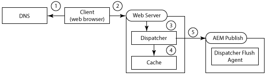
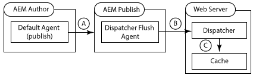
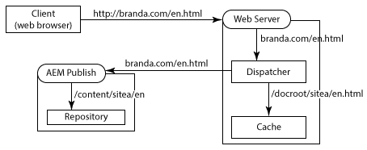
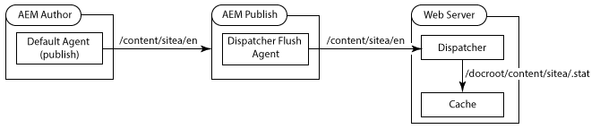
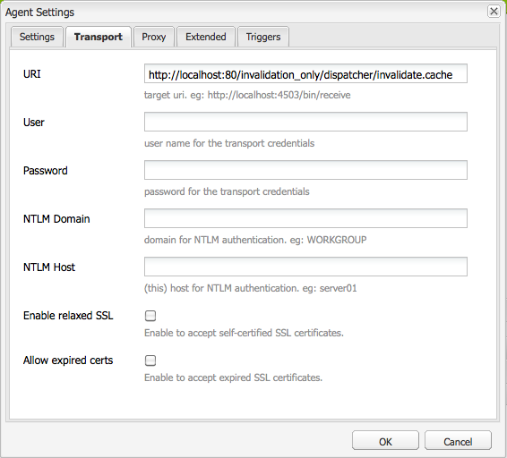
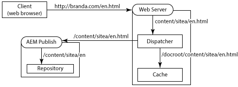
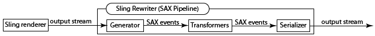

# Using Dispatcher with Multiple Domains {#using-dispatcher-with-multiple-domains}

>[!NOTE]
>
>Dispatcher versions are independent of AEM. You may have been redirected to this page if you followed a link to the Dispatcher documentation that is embedded in AEM or CQ documentation.

Use the Dispatcher to process page requests in multiple web domains while supporting the following conditions:

* Web content for both domains is stored in a single AEM repository.
* The files in the Dispatcher cache can be invalidated separately for each domain.

For example, a company publishes websites for two of their brands: Brand A and Brand B. The content for the website pages is authored in AEM, and stored in the same repository workspace:

```

/
| - content  
   | - sitea  
       | - content nodes  
   | - siteb  
       | - content nodes

```

Pages for `BrandA.com` are stored below `/content/sitea`. Client requests for the URL `https://BrandA.com/en.html` are returned the rendered page for the `/content/sitea/en` node. Similarly, pages for `BrandB.com` are stored below `/content/siteb`.

When using Dispatcher to cache content, make associations between the page URL in the client HTTP request, the path of the corresponding cached file, and the path of the corresponding file in the repository.

## Client requests

When clients send HTTP requests to the web server, the URL of the requested page must be resolved to the content in the Dispatcher cache, and eventually to the content in the repository.



1. The domain name system discovers the IP address of the Web server that is registered for the domain name in the HTTP request.
1. The HTTP request is sent to the web server.
1. The HTTP request is passed to the Dispatcher.
1. Dispatcher determines whether the cached files are valid. If valid, the cached files are served to the client.
1. If cached files are not valid, Dispatcher requests newly rendered pages from the AEM publish instance.

## Cache Invalidation

When Dispatcher Flush replication agents request that Dispatcher invalidates cached files, the path of the content in the repository must resolve to the content in the cache.



* a - A page is activated on the AEM author instance and the content is replicated to the publishing instance.
* b - The Dispatcher Flush Agent calls Dispatcher to invalidate the cache for the replicated content.
* c - Dispatcher touches one or more .stat files to invalidate the cached files.

To use Dispatcher with multiple domains, you must configure AEM, Dispatcher, and your web server. The solutions described on this page are general and apply to most environments. Due to the complexity of some AEM topologies, your solution can require further custom configurations to resolve particular issues. You likely must adapt the examples to satisfy your existing IT infrastructure and management policies.

## URL Mapping {#url-mapping}

To enable domain URLs and content paths to resolve to cached files, a file path or page URL must be translated during the process. Descriptions of the following common strategies are provided, where path or URL translations occur at different points in the process:

* (Recommended) The AEM publish instance uses Sling mapping for resource resolution to implement internal URL rewriting rules. Domain URLs are translated to content repository paths. See [AEM Rewrites Incoming URLs](#aem-rewrites-incoming-urls).
* The web server uses internal URL rewriting rules that translate domain URLs to cache paths. See [The Web Server Rewrites Incoming URLs](#the-web-server-rewrites-incoming-urls).

It is desirable to use short URLs for web pages. Typically, page URLs mirror the structure of the repository folders that contain the web content. However, the URLs do not reveal the topmost repository nodes, such as `/content`. The client is not necessarily aware of the structure of the AEM repository.

## General Requirements {#general-requirements}

Your environment must implement the following configurations to support Dispatcher working with multiple domains:

* Content for each domain resides in separate branches of the repository (see the example environment below).
* The Dispatcher Flush replication agent is configured on the AEM publish instance. (See [Invalidating Dispatcher Cache from a Publishing Instance](page-invalidate.md).)
* The domain name system resolves the domain names to the IP address of the web server.
* The Dispatcher cache mirrors the directory structure of the AEM content repository. The file paths below the document root of the web server are the same as the paths of the files in the repository.

## Environment for the Provided Examples {#environment-for-the-provided-examples}

The example solutions that are provided apply to an environment with the following characteristics:

* The AEM author and publish instances are deployed on Linux&reg; systems.
* Apache HTTPD is the web server that is deployed on a Linux&reg; system.
* The AEM content repository and the document root of the web server use the following file structures (the document root of the Apache web server is /`usr/lib/apache/httpd-2.4.3/htdocs)`:

  **Repository**

```
  | - /content  
    | - sitea  
  |    | - content nodes
    | - siteb  
       | - content nodes
```

  **Document root of the web server**

```
  | - /usr  
    | - lib  
      | - apache  
        | - httpd-2.4.3  
          | - htdocs  
            | - content  
              | - sitea  
                 | - content nodes 
              | - siteb  
                 | - content nodes
```

## AEM Rewrites Incoming URLs {#aem-rewrites-incoming-urls}

Sling mapping for resource resolution enables you to associate incoming URLs with AEM content paths. Create mappings on the AEM publish instance so that render requests from Dispatcher resolve to the correct content in the repository.

Dispatcher requests for page rendering identify the page using the URL that it is passed from the web server. When the URL includes a domain name, Sling mappings resolve the URL to the content. The following graphic illustrates a mapping of the `branda.com/en.html` URL to the `/content/sitea/en` node.



The Dispatcher cache mirrors the repository node structure. Therefore, when page activations occur the resulting requests for invalidating the cached page require no URL or path translations.

 

## Define virtual hosts on the web server {#define-virtual-hosts-on-the-web-server}

Define virtual hosts on the web server so that a different document root can be assigned to each web domain:

* The web server must define a virtual domain for each of your web domains.
* For each domain, configure the document root to coincide with the folder in the repository that contains the domain's web content.
* Each virtual domain must also include Dispatcher-related configurations, as described on the [Installing Dispatcher](dispatcher-install.md) page.

The following example `httpd.conf` file configures two virtual domains for an Apache web server:

* The server names (which coincide with the domain names) are branda.com (line 16) and brandb.com (line 30).
* The document root of each virtual domain is the directory in the Dispatcher cache that contains the site's pages. (lines 17 and 31)

With this configuration, the web server performs the following actions when it receives a request for `https://branda.com/en/products.html`:

* Associates the URL with the virtual host that has a `ServerName` of `branda.com.`

* Forwards the URL to Dispatcher.

### httpd.conf {#httpd-conf}

```xml
# load the Dispatcher module
LoadModule dispatcher_module modules/mod_dispatcher.so
# configure the Dispatcher module
<IfModule disp_apache2.c>
 DispatcherConfig conf/dispatcher.any
 DispatcherLog    logs/dispatcher.log  
 DispatcherLogLevel 3
 DispatcherNoServerHeader 0 
 DispatcherDeclineRoot 0
 DispatcherUseProcessedURL 0
 DispatcherPassError 0
</IfModule>

# Define virtual host for brandA.com
<VirtualHost *:80>
  ServerName branda.com
  DocumentRoot /usr/lib/apache/httpd-2.4.3/htdocs/content/sitea
   <Directory /usr/lib/apache/httpd-2.4.3/htdocs/content/sitea>
     <IfModule disp_apache2.c>
       SetHandler dispatcher-handler
       ModMimeUsePathInfo On
     </IfModule>
     Options FollowSymLinks
     AllowOverride None
   </Directory>
</VirtualHost>

# define virtual host for brandB.com
<VirtualHost *:80>
  ServerName brandB.com
  DocumentRoot /usr/lib/apache/httpd-2.4.3/htdocs/content/siteb
   <Directory /usr/lib/apache/httpd-2.4.3/htdocs/content/siteb>
     <IfModule disp_apache2.c>
       SetHandler dispatcher-handler
       ModMimeUsePathInfo On
     </IfModule>
     Options FollowSymLinks
     AllowOverride None
   </Directory>
</VirtualHost>

# document root for web server
DocumentRoot "/usr/lib/apache/httpd-2.4.3/htdocs"
```

Virtual hosts inherit the [DispatcherConfig](dispatcher-install.md#main-pars-67-table-7) property value that is configured in the main server section. Virtual hosts can include their own DispatcherConfig property to override the main server configuration.

### Configure Dispatcher to Handle Multiple Domains {#configure-dispatcher-to-handle-multiple-domains}

To support URLs that include domain names and their corresponding virtual hosts, define the following Dispatcher farms:

* Configure a Dispatcher farm for each virtual host. These farms process requests from the web server for each domain, check for cached files, and request pages from the renders.  
* Configure a Dispatcher farm that is used for invalidating content in the cache, regardless of which domain the content belongs to. This farm handles file invalidation requests from Flush Dispatcher replication agents.

### Create Dispatcher farms for virtual hosts

Farms for virtual hosts must have the following configurations so that the URLs in client HTTP requests are resolved to the correct files in the Dispatcher cache:

* The `/virtualhosts` property is set to the domain name. This property enables the Dispatcher to associate the farm with the domain.
* The `/filter` property allows access to the path of the request URL truncated after the domain name part. For example, for the `https://branda.com/en.html` URL, the path is interpreted as `/en.html`, so the filter must allow access to this path.

* The `/docroot` property is set to the path of the root directory. That is, the root directory of the domain's site content in the Dispatcher cache. This path is used as the prefix for the concatenated URL from the original request. For example, the docroot of `/usr/lib/apache/httpd-2.4.3/htdocs/sitea` causes the request for `https://branda.com/en.html` to resolve to the `/usr/lib/apache/httpd-2.4.3/htdocs/sitea/en.html` file.

Also, the AEM publish instance must be designated as the render for the virtual host. Configure other farm properties as required. The following code is an abbreviated farm configuration for the branda.com domain:

```xml
/farm_sitea  {     
    ...
    /virtualhosts { "branda.com" }
    /renders {
      /rend01  { /hostname "127.0.0.1"  /port "4503" }
    }
    /filter {
      /0001 { /type "deny"  /glob "*" }
      /0023 { /type "allow" /glob "*/en*" }  
      ...
     }
    /cache {
      /docroot "/usr/lib/apache/httpd-2.4.3/htdocs/content/sitea"
      ...
   }
   ...
}
```

### Create a Dispatcher farm for cache invalidation

A Dispatcher farm is required for handling requests for invalidating cached files. This farm must be able to access .stat files in the `docroot` directories of each virtual host.

The following property configurations enable the Dispatcher to resolve files in the AEM content repository from files in the cache:

* The `/docroot` property is set to the default `docroot` of the web server. Typically, the /`docroot` is the directory where the `/content` folder is created. An example value for Apache on Linux&reg; is `/usr/lib/apache/httpd-2.4.3/htdocs`.
* The `/filter` property allows access to files below the `/content` directory.

The `/statfileslevel`property must be high enough so that .stat files are created in the root directory of each virtual host. This property enables the cache of each domain to be invalidated separately. For the example setup, a `/statfileslevel` value of `2` creates .stat files in the `*docroot*/content/sitea` directory and the `*docroot*/content/siteb` directory.

Also, the publish instance must be designated as the render for the virtual host. Configure other farm properties as required. The following code is an abbreviated configuration for the farm that is used for invalidating the cache:

```xml
/farm_flush {  
    ...
    /virtualhosts   { "invalidation_only" }
    /renders  {
      /rend01  { /hostname "127.0.0.1" /port "4503" }
    }
    /filter   {
      /0001 { /type "deny"  /glob "*" }
      /0023 { /type "allow" /glob "*/content*" } 
      ...
      }
    /cache  {
       /docroot "/usr/lib/apache/httpd-2.4.3/htdocs"
       /statfileslevel "2"
       ...
   }
   ...
}
```

When you start the web server, the Dispatcher log (in debug mode) indicates the initialization of all farms:

```shell
Dispatcher initializing (build 4.1.2)
[Fri Nov 02 16:27:18 2012] [D] [24974(140006182991616)] farms[farm_sitea].cache.docroot = /usr/lib/apache/httpd-2.4.3/htdocs/content/sitea
[Fri Nov 02 16:27:18 2012] [D] [24974(140006182991616)] farms[farm_siteb].cache.docroot = /usr/lib/apache/httpd-2.4.3/htdocs/content/siteb
[Fri Nov 02 16:27:18 2012] [D] [24974(140006182991616)] farms[farm_flush].cache.docroot = /usr/lib/apache/httpd-2.4.3/htdocs
[Fri Nov 02 16:27:18 2012] [I] [24974(140006182991616)] Dispatcher initialized (build 4.1.2)
```

### Configure Sling Mapping for Resource Resolution {#configure-sling-mapping-for-resource-resolution}

Use Sling mapping for resource resolution so that domain-based URLs resolve to content on the AEM publish instance. The resource mapping translates the incoming URLs from Dispatcher (originally from client HTTP requests) to content nodes.

To learn about Sling resource mapping, see [Mappings for Resource Resolution](https://sling.apache.org/documentation/the-sling-engine/mappings-for-resource-resolution.html) in the Sling documentation.

Typically, mappings are required for the following resources, although other mappings can be necessary:

* The root node of the content page (below `/content`)
* The design node that the pages use (below `/etc/designs`)
* The `/libs` folder

After you create the mapping for the content page, to discover more required mappings use a web browser to open a page on the web server. In the error.log file of the publish instance, locate messages about resources that are not found. The following example message indicates that a mapping for `/etc/clientlibs` is required:

```shell
01.11.2012 15:59:24.601 *INFO* [10.36.34.243 [1351799964599] GET /etc/clientlibs/foundation/jquery.js HTTP/1.1] org.apache.sling.engine.impl.SlingRequestProcessorImpl service: Resource /content/sitea/etc/clientlibs/foundation/jquery.js not found
```

>[!NOTE]
>
>The Linkchecker transformer of the default Apache Sling rewriter automatically modifies hyperlinks in the page to prevent broken links. However, link rewriting is performed only when the link target is an HTML or HTM file. To update links to other file types, create a transformer component and add it to an HTML rewriter pipeline.

### Example resource-mapping nodes

The following table lists the nodes that implement resource mapping for the branda.com domain. Similar nodes are created for the `brandb.com` domain, such as `/etc/map/http/brandb.com`. In all cases, mappings are required when references in the HTML page do not resolve correctly in the context of Sling.

|Node path|Type|Property|
|--- |--- |--- |
|`/etc/map/http/branda.com`| `sling:Mapping` | `Name: sling:internalRedirect Type: String Value: /content/sitea` |
|`/etc/map/http/branda.com/libs`| `sling:Mapping` | `Name: sling:internalRedirect <br/>Type: String <br/>Value: /libs` |
|`/etc/map/http/branda.com/etc`| `sling:Mapping` | |
|`/etc/map/http/branda.com/etc/designs`| `sling:Mapping` | `Name: sling:internalRedirect <br/>VType: String <br/>VValue: /etc/designs`|
|`/etc/map/http/branda.com/etc/clientlibs`| `sling:Mapping` | `Name: sling:internalRedirect <br/>VType: String <br/>VValue: /etc/clientlibs` |

## Configuring the Dispatcher Flush replication agent {#configuring-the-dispatcher-flush-replication-agent}

The Dispatcher Flush replication agent on the AEM publish instance must send invalidation requests to the correct Dispatcher farm. To target a farm, use the URI property of the Dispatcher Flush replication agent (on the Transport tab). Include the value of the `/virtualhost` property for the Dispatcher farm that is configured for invalidating the cache:

`https://*webserver_name*:*port*/*virtual_host*/dispatcher/invalidate.cache`

For example, to use the `farm_flush` farm of the previous example, the URI is `https://localhost:80/invalidation_only/dispatcher/invalidate.cache`.

 

## The Web Server Rewrites Incoming URLs {#the-web-server-rewrites-incoming-urls}

To translate domain-based URLs to file paths in the Dispatcher cache, use the internal URL rewriting feature of your web server. For example, client requests for the `https://brandA.com/en.html` page are translated to the `content/sitea/en.html`file in the document root of the web server.



The Dispatcher cache mirrors the repository node structure. Therefore, when page activations occur the resulting requests for invalidating the cached page require no URL or path translations. 

 

## Define virtual hosts and rewrite rules on the Web server {#define-virtual-hosts-and-rewrite-rules-on-the-web-server}

Configure the following aspects on the web server:

* Define a virtual host for each of your web domains.
* For each domain, configure the document root to coincide with the folder in the repository that contains the domain's web content.
* For each virtual domain, create a URL renaming rule that translates the incoming URL to the path of the cached file. 
* Each virtual domain must also include Dispatcher-related configurations, as described on the [Installing Dispatcher](dispatcher-install.md) page.
* The Dispatcher module must be configured to use the URL that the web server has rewritten. (See the `DispatcherUseProcessedURL` property in [Installing Dispatcher](dispatcher-install.md).)

The following example httpd.conf file configures two virtual hosts for an Apache web server:

* The server names (which coincide with the domain names) are `brandA.com` (Line 16) and `brandB.com` (Line 32).

* The document root of each virtual domain is the directory in the Dispatcher cache that contains the site's pages. (Lines 20 and 33)
* The URL rewrite rule for each virtual domain is a regular expression. The regular expression prefixes the path of the requested page. It is prefixed with the path to the pages in the cache. (Lines 19 and 35)
* The `DispatherUseProcessedURL` property is set to `1`. (Line 10)

For example, the web server performs the following actions when it receives a request with the `https://brandA.com/en/products.html` URL:

* Associates the URL with the virtual host that has a `ServerName` of `brandA.com.`
* Rewrites the URL to be `/content/sitea/en/products.html.`
* Forwards the URL to Dispatcher.

### httpd.conf {#httpd-conf-1}

```xml
# load the Dispatcher module
LoadModule dispatcher_module modules/mod_dispatcher.so
# configure the Dispatcher module
<IfModule disp_apache2.c>
 DispatcherConfig conf/dispatcher.any
 DispatcherLog    logs/dispatcher.log  
 DispatcherLogLevel 3
 DispatcherNoServerHeader 0 
 DispatcherDeclineRoot 0
 DispatcherUseProcessedURL 1
 DispatcherPassError 0
</IfModule>

# Define virtual host for brandA.com
<VirtualHost *:80>
  ServerName branda.com
  DocumentRoot /usr/lib/apache/httpd-2.4.3/htdocs/content/sitea
  RewriteEngine  on
  RewriteRule    ^/(.*)\.html$  /content/sitea/$1.html [PT]
   <Directory /usr/lib/apache/httpd-2.4.3/htdocs/content/sitea>
     <IfModule disp_apache2.c>
       SetHandler dispatcher-handler
       ModMimeUsePathInfo On
     </IfModule>
     Options FollowSymLinks
     AllowOverride None
   </Directory>
</VirtualHost>

# define virtual host for brandB.com
<VirtualHost *:80>
  ServerName brandB.com
  DocumentRoot /usr/lib/apache/httpd-2.4.3/htdocs/content/siteb
  RewriteEngine  on
  RewriteRule    ^/(.*)\.html$  /content/siteb/$1.html [PT]
   <Directory /usr/lib/apache/httpd-2.4.3/htdocs/content/siteb>
     <IfModule disp_apache2.c>
       SetHandler dispatcher-handler
       ModMimeUsePathInfo On
     </IfModule>
     Options FollowSymLinks
     AllowOverride None
   </Directory>
</VirtualHost>

# document root for web server
DocumentRoot "/usr/lib/apache/httpd-2.4.3/htdocs"
```

### Configure a Dispatcher Farm {#configure-a-dispatcher-farm}

When the web server rewrites URLs, Dispatcher requires a single farm defined according to [Configuring Dispatcher](dispatcher-configuration.md). The following configurations are required to support the web server virtual hosts and URL renaming rules:

* The `/virtualhosts` property must include the ServerName values for the all VirtualHost definitions.
* The `/statfileslevel` property must be high enough to create .stat files in the directories that contain the content files for each domain.

The following example configuration file is based on the example `dispatcher.any` file that is installed with Dispatcher. The following changes are required to support the web server configurations of the previous `httpd.conf` file:

* The `/virtualhosts` property causes Dispatcher to handle requests for the `brandA.com` and `brandB.com` domains. (Line 12)
* The `/statfileslevel` property is set to 2, so that stat files are created in each directory that contains the domain's web content (line 41): `/statfileslevel "2"`

As usual, the document root of the cache is the same as the document root of the web server (line 40): `/usr/lib/apache/httpd-2.4.3/htdocs`

### `dispatcher.any` {#dispatcher-any}

```xml
/name "testDispatcher"
/farms
  {
  /dispfarm0
    {  
    /clientheaders
      {
      "*"
      }      
    /virtualhosts
      {
      "brandA.com" "brandB.com"
      }
    /renders
      {
      /rend01    {  /hostname "127.0.0.1"   /port "4503"  }
      }
    /filter
      {
      /0001 { /type "deny"  /glob "*" }
      /0023 { /type "allow" /glob "*/content*" }  # disable this rule to allow mapped content only
      /0041 { /type "allow" /glob "* *.css *"   }  # enable css
      /0042 { /type "allow" /glob "* *.gif *"   }  # enable gifs
      /0043 { /type "allow" /glob "* *.ico *"   }  # enable icos
      /0044 { /type "allow" /glob "* *.js *"    }  # enable javascript
      /0045 { /type "allow" /glob "* *.png *"   }  # enable png
      /0046 { /type "allow" /glob "* *.swf *"   }  # enable flash
      /0061 { /type "allow" /glob "POST /content/[.]*.form.html" }  # allow POSTs to form selectors under content
      /0062 { /type "allow" /glob "* /libs/cq/personalization/*"  }  # enable personalization
      /0081 { /type "deny"  /glob "GET *.infinity.json*" }
      /0082 { /type "deny"  /glob "GET *.tidy.json*"     }
      /0083 { /type "deny"  /glob "GET *.sysview.xml*"   }
      /0084 { /type "deny"  /glob "GET *.docview.json*"  }
      /0085 { /type "deny"  /glob "GET *.docview.xml*"  }      
      /0086 { /type "deny"  /glob "GET *.*[0-9].json*" }
      /0090 { /type "deny"  /glob "* *.query.json*" }
      }
    /cache
      {
      /docroot "/usr/lib/apache/httpd-2.4.3/htdocs"
      /statfileslevel "2"
      /allowAuthorized "0"
      /rules
        {
        /0000  { /glob "*"     /type "allow"  }
        }
      /invalidate
        {
        /0000  {   /glob "*" /type "deny"  }
        /0001 {  /glob "*.html" /type "allow"  }
        }
      /allowedClients
        {
        }     
      }
    /statistics
      {
      /categories
        {
        /html  { /glob "*.html" }
        /others  {  /glob "*"  }
        }
      }
    }
  }
```

>[!NOTE]
>
>Because a single Dispatcher farm is defined, the Dispatcher Flush replication agent on the AEM publish instance requires no special configurations.

## Rewriting Links to Non-HTML Files {#rewriting-links-to-non-html-files}

To rewrite references to files that have extensions other than .html or .htm, create a Sling rewriter transformer component and add it to the default rewriter pipeline.

Rewrite references when resource paths do not resolve correctly in the web server context. For example, a transformer is required when image-generating components create links such as /content/sitea/en/products.navimage.png. The `topnav` component of the [How to Create a Fully Featured Internet Website](https://experienceleague.adobe.com/en/docs/experience-manager-65/content/implementing/developing/introduction/the-basics) creates such links.

The [Sling rewriter](https://sling.apache.org/documentation/bundles/output-rewriting-pipelines-org-apache-sling-rewriter.html) is a module that post-processes Sling output. SAX pipeline implementations of the rewriter consist of a generator, one or more transformers, and a serializer:

* **Generator:** Parses the Sling output stream (HTML document) and generates SAX events when it encounters specific element types. 
* **Transformer:** Listens for SAX events and therefore modifies the event target (an HTML element). A rewriter pipeline contains zero or more transformers. Transformers are executed in sequence, passing the SAX events to the next transformer in the sequence.
* **Serializer:** Serializes the output, including the modifications from each transformer.

 

### The AEM Default Rewriter Pipeline {#the-aem-default-rewriter-pipeline}

AEM uses a default pipeline rewriter that processes documents of the type text/html:

* The generator parses HTML documents and generates SAX events when it encounters a, img, area, form, base, link, script, and body elements. The generator alias is `htmlparser`.
* The pipeline includes the following transformers: `linkchecker`, `mobile`, `mobiledebug`, `contentsync`. The `linkchecker` transformer externalizes paths to referenced HTML or HTM files to prevent broken links.
* The serializer writes the HTML output. The serializer alias is htmlwriter.

The `/libs/cq/config/rewriter/default` node defines the pipeline.

### Creating a Transformer {#creating-a-transformer}

To create a transformer component and use it in a pipeline, perform the following tasks:

1. Implement the `org.apache.sling.rewriter.TransformerFactory` interface. This class creates instances of your transformer class. Specify values for the `transformer.type` property (the transformer alias) and configure the class as an OSGi service component. 
1. Implement the `org.apache.sling.rewriter.Transformer` interface. To minimize the work, you can extend the `org.apache.cocoon.xml.sax.AbstractSAXPipe` class. To customize the rewriting behavior, override the startElement method. This method is called for every SAX event that is passed to the transformer.
1. Bundle and deploy the classes.
1. To add the transformer to the pipeline, add a configuration node to your AEM application.

>[!TIP]
>You can instead configure the TransformerFactory so that the transformer is inserted into every rewriter that is defined. Therefore, you do not need to configure a pipeline:
>
>* Set the `pipeline.mode` property to `global`.
>* Set the `service.ranking` property to a positive integer.
>* Do not include a `pipeline.type` property.

>[!NOTE]
>
>To create your Maven project, use the [multimodule](https://experienceleague.adobe.com/en/docs/experience-manager-release-information/aem-release-updates/previous-updates/aem-previous-versions) archetype of the Content Package Maven Plugin. The POMs automatically create and install a content package.

The following examples implement a transformer that rewrites references to image files.

* The MyRewriterTransformerFactory class instantiates MyRewriterTransformer objects. The pipeline.type property sets the transformer alias to `mytransformer`. To include the alias in a pipeline, the pipeline configuration node should include the alias in the list of transformers. 
* The MyRewriterTransformer class overrides the startElement method of the AbstractSAXTransformer class. The startElement method rewrites the value of src attributes for img elements.

The examples are not robust. Do not use them in a production environment.

### Example TransformerFactory implementation {#example-transformerfactory-implementation}

```java
package com.adobe.example;

import org.apache.felix.scr.annotations.Component;
import org.apache.felix.scr.annotations.Service;
import org.apache.felix.scr.annotations.Property;

import org.apache.sling.rewriter.Transformer;
import org.apache.sling.rewriter.TransformerFactory;

@Component
@Service
public class MyRewriterTransformerFactory implements TransformerFactory {
    /* Define the alias */
    @Property(value="mytransformer")
    static final String PIPELINE_TYPE ="pipeline.type";
 
    public Transformer createTransformer() {
        
        return new MyRewriterTransformer ();
    }
}
```

### Example Transformer implementation {#example-transformer-implementation}

```java
package com.adobe.example;

import java.io.IOException;

import org.apache.cocoon.xml.sax.AbstractSAXPipe;

import org.apache.sling.api.SlingHttpServletRequest;
import org.apache.sling.rewriter.ProcessingComponentConfiguration;
import org.apache.sling.rewriter.ProcessingContext;
import org.apache.sling.rewriter.Transformer;

import org.slf4j.Logger;
import org.slf4j.LoggerFactory;

import org.xml.sax.Attributes;
import org.xml.sax.SAXException;
import org.xml.sax.helpers.AttributesImpl;

import javax.servlet.http.HttpServletRequest;

public class MyRewriterTransformer extends AbstractSAXPipe implements Transformer {

 private static final Logger log = LoggerFactory.getLogger(MyRewriterTransformer.class);
 private SlingHttpServletRequest httpRequest; 
 /* The element and attribute to act on  */
 private static final String ATT_NAME = new String("src");
 private static final String EL_NAME = new String("img");

 public MyRewriterTransformer () {
 }
 public void dispose() {
 }
 public void init(ProcessingContext context, ProcessingComponentConfiguration config) throws IOException {
  this.httpRequest = context.getRequest();
  log.debug("Transforming request {}.", httpRequest.getRequestURI());
 }
 @Override
 public void startElement (String nsUri, String localname, String qname, Attributes atts) throws SAXException {
  /* copy the element attributes */
  AttributesImpl linkAtts = new AttributesImpl(atts); 
  /* Only interested in EL_NAME elements */
  if(EL_NAME.equalsIgnoreCase(localname)){

   /* iterate through the attributes of the element and act only on ATT_NAME attributes */
   for (int i=0; i < linkAtts.getLength(); i++) {
    if (ATT_NAME.equalsIgnoreCase(linkAtts.getLocalName(i))) {
     String path_in_link = linkAtts.getValue(i);

     /* use the resource resolver of the http request to reverse-resolve the path  */
     String mappedPath = httpRequest.getResourceResolver().map(httpRequest, path_in_link);

     log.info("Tranformed {} to {}.", path_in_link,mappedPath);

     /* update the attribute value */
     linkAtts.setValue(i,mappedPath);
    }
   }

  }
        /* return updated attributes to super and continue with the transformer chain */
 super.startElement(nsUri, localname, qname, linkAtts);
 }
}
```

### Adding the Transformer to a Rewriter Pipeline {#adding-the-transformer-to-a-rewriter-pipeline}

Create a JCR node that defines a pipeline that uses your transformer. The following node definition creates a pipeline that processes text/html files. The default AEM generator and parser for HTML are used.

>[!NOTE]
>
>If you set the Transformer property `pipeline.mode` to `global`, you do not need to configure a pipeline. The `global` mode inserts the transformer into all pipelines.

### Rewriter configuration node - XML representation {#rewriter-configuration-node-xml-representation}

```xml
<?xml version="1.0" encoding="UTF-8"?>
<jcr:root xmlns:jcr="https://www.jcp.org/jcr/1.0" xmlns:nt="https://www.jcp.org/jcr/nt/1.0"
    jcr:primaryType="nt:unstructured"
    contentTypes="[text/html]"
    enabled="{Boolean}true"
    generatorType="htmlparser"
    order="5"
    serializerType="htmlwriter"
    transformerTypes="[mytransformer]">
</jcr:root>
```

The following graphic shows the CRXDE Lite representation of the node:


