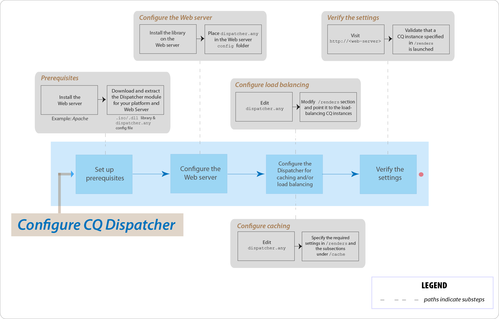

# AEM Dispatcher Top Issues FAQ



## Introduction

### What is the Dispatcher?

The Dispatcher is Adobe Experience Manager's caching and/or load-balancing tool that helps realize a fast and dynamic Web authoring environment. For caching, the Dispatcher works as part of an HTTP server, such as Apache. It has the aim of storing (or "caching") as much of the static website content as possible and accessing the website's layout engine as infrequently as possible. In a load-balancing role, the Dispatcher distributes user requests (load) across different AEM instances (renders).

For caching, the Dispatcher module uses the Web server's ability to serve static content. The Dispatcher places the cached documents in the document root of the Web server.

### How does the Dispatcher perform caching?

The Dispatcher uses the web server's ability to serve static content. The Dispatcher stores cached documents in the web server's document root. The Dispatcher has two primary methods for updating the cache content when changes are made to the website.

* **Content Updates** remove the pages that have changed, and files that are directly associated with them.
* **Auto-Invalidation** automatically invalidates those parts of the cache that may be out of date after an update. For example, it effectively flags relevant pages as being out of date, without deleting anything.

### What are the benefits of load-balancing?

Load-balancing distributes user requests (load) across several AEM instances. The following list describes the advantages for load-balancing:

* **Increased processing power**: In practice, this method means that the Dispatcher shares document requests between several instances of AEM. Because each instance has fewer documents to process, you have faster response times. The Dispatcher keeps internal statistics for each document category, so it can estimate the load and distribute the queries efficiently.
* **Increased fail-safe coverage**: If the Dispatcher does not receive responses from an instance, it automatically relays requests to one of the other instances. Thus, if an instance becomes unavailable, the only effect is a slowdown of the site, proportionate to the computational power lost.

>[!NOTE]
>
>For further details, see the [Dispatcher Overview page](dispatcher.md)

## Install and Configure

### Where do I download the Dispatcher module from?

You can download the latest Dispatcher module from the [Dispatcher Release Notes](release-notes.md) page.

### How do I install the Dispatcher module?

Refer to the [Installing Dispatcher](dispatcher-install.md) page

### How do I configure the Dispatcher module?

See the [Configuring Dispatcher](dispatcher-configuration.md) page.

### How do I configure the Dispatcher for the author instance?

See [Using Dispatcher with an Author Instance](dispatcher.md#using-a-dispatcher-with-an-author-server) for the detailed steps.

### How do I configure the Dispatcher with multiple domains?

You can configure the CQ Dispatcher with multiple domains, provided the domains satisfy the following conditions:

* The Web content for both the domains is stored in a single AEM repository
* The files in the Dispatcher cache can be invalidated separately for each domain

Read [Using Dispatcher with Multiple Domains](dispatcher-domains.md) for further details.

### How do I configure the Dispatcher, such that all requests from a user are routed to the same Publish instance?

You can use the [sticky connections](dispatcher-configuration.md#identifying-a-sticky-connection-folder-stickyconnectionsfor) feature, which ensures that all documents for a user are processed on the same instance of AEM. This feature is important if you use personalized pages and session data. The data is stored on the instance. Therefore, subsequent requests from the same user must return to that instance or the data is lost.

Because sticky connections restrict the Dispatcher's ability to optimize requests, you should use this approach only when necessary. You can specify the folder that contains the "sticky" documents, thus ensuring all documents in that folder are processed on the same instance for a user.

### Can I use sticky connections and caching in tandem?

For most pages that use sticky connections, you should turn off caching. Otherwise, the same instance of the page is displayed to all users, regardless of the session content.

For some applications, it can be possible to use both sticky connections and caching. For example, if you display a form that writes data to a session, you can use sticky connections and caching in tandem.

### Can a Dispatcher and an AEM Publish instance reside on the same physical machine?

Yes, if the machine is sufficiently powerful. However, it is recommended that you set up the Dispatcher and the AEM Publish instance on different machines.

Usually, the Publish instance resides inside the firewall and the Dispatcher resides in the DMZ. If you decide to have both the Publish instance and Dispatcher on the same physical machine, ensure that the firewall settings prohibit direct access to the Publish instance from external networks.

### Can I cache only files with specific extensions?

Yes. For example, if you want to cache only GIF files, specify *.gif in the cache section of the dispatcher.any configuration file.

### How do I delete files from the cache?

You can delete files from the cache by using an HTTP request. When the HTTP request is received, Dispatcher deletes the files from the cache. Dispatcher caches the files again only when it receives a client request for the page. Deleting cached files in this manner is appropriate for web sites that are not likely to receive simultaneous requests for the same page.

The HTTP request has the following syntax:

```
POST /dispatcher/invalidate.cache HTTP/1.1
CQ-Action: Activate
CQ-Handle: path-pattern
Content-Length: 0
```

Dispatcher deletes the cached files and folders that have names that match the value of the CQ-Handle header. For example, a CQ-Handle of `/content/geomtrixx-outdoors/en` matches the following items:

All files (of any file extension) named en in the geometrixx-outdoors directory.
Any directory named `_jcr_content` below the en directory (which, if it exists, contains cached renderings of subnodes of the page).
The directory `en` is only be deleted if the `CQ-Action` is `Delete` or `Deactivate`.

For further details on this topic, see [Manually Invalidating the Dispatcher Cache](page-invalidate.md).

### How do I implement permission-sensitive caching?

See the [Caching Secure Content](permissions-cache.md) page.

### How do I secure communications between the Dispatcher and CQ instances?

See the [Dispatcher Security Checklist](security-checklist.md) and the [AEM Security Checklist](https://experienceleague.adobe.com/docs/experience-manager-64/administering/security/security-checklist.html?lang=en) pages.

### Dispatcher issue `jcr:content` changed to `jcr%3acontent`

**Question**: The business has recently faced a problem at Dispatcher level. One of the AJAX calls which was getting some data form CQ repository had `jcr:content` in it. That got encoded to `jcr%3acontent` resulting in that wrong result set.

**Answer**: Use `ResourceResolver.map()` method to get a 'Friendly' URL to be used / issued get requests from and also to solve the caching issue with Dispatcher. The map() method encodes the `:` colon to underscores and the resolve() method decodes them back to SLING JCR readable format. Use the map() method to generate the URL that is used in the Ajax call.

Further read: [https://sling.apache.org/documentation/the-sling-engine/mappings-for-resource-resolution.html#namespace-mangling](https://sling.apache.org/documentation/the-sling-engine/mappings-for-resource-resolution.html#namespace-mangling)

## Flush the Dispatcher

### How do I configure Dispatcher flush agents on a Publish instance?

See the [Replication](https://experienceleague.adobe.com/docs/experience-manager-65/deploying/configuring/replication.html?lang=en#configuring-your-replication-agents) page.

### How do I troubleshoot Dispatcher flushing issues?

[See these troubleshooting articles](https://experienceleague.adobe.com/search.html?lang=en#q=troubleshooting%20dispatcher%20flushing%20issues&sort=relevancy&f:el_product=[Experience%20Manager]).

If Delete operations are causing the Dispatcher to flush, [use the workaround in this community blog post by Sensei Martin](https://mkalugin-cq.blogspot.com/2012/04/i-have-been-working-on-following.html).

### How do I flush DAM assets from the Dispatcher cache?

You can use the "chain replication" feature. With this feature enabled, the Dispatcher flush agent sends a flush request when a replication is received from author.

To enable it:

1. [Follow the steps here](page-invalidate.md#invalidating-dispatcher-cache-from-a-publishing-instance) to create flushing agents on publish
1. Go to each agent's configuration and on the **Triggers** tab, check the **On Receive** box.

## Miscellaneous

How does the Dispatcher determine if a document is up-to-date?
To determine whether a document is up-to-date, the Dispatcher performs these actions:

It checks whether the document is subject to auto-invalidation. If not, the document is considered up-to-date.
If the document is configured for auto-invalidation, the Dispatcher checks whether it is older or newer than the last change available. If it is older, the Dispatcher requests the current version from the AEM instance and replaces the version in the cache.

### How does the Dispatcher return documents?

You can define whether the Dispatcher caches a document by using the [Dispatcher configuration](dispatcher-configuration.md) file, `dispatcher.any`. The Dispatcher checks the request against the list of cacheable documents. If the document is not in this list, the Dispatcher requests the document from the AEM instance.

The `/rules` property controls which documents are cached according to the document path. Regardless of the `/rules` property, Dispatcher never caches a document in the following circumstances:

* The request URI contains a `(?)` question mark.
* It indicates a dynamic page, such as a search result that does not need to be cached.
* The file extension is missing.
* The web server needs the extension to determine the document type (the MIME-type).
* The authentication header is set (configurable).
* If the AEM instance responds with the following headers: 
  * no-cache
  * no-store
  * must-revalidate

The Dispatcher stores cached files on the web server as if they were part of a static website. If a user requests a cached document, the Dispatcher checks whether the document exists in the web server's file system. If so, the Dispatcher returns the documents. If not, the Dispatcher requests the document from the AEM instance.

>[!NOTE]
>
>The GET or HEAD (for the HTTP header) methods are cacheable by the Dispatcher. For additional information on response header caching, see the [Caching HTTP Response Headers](dispatcher-configuration.md#caching-http-response-headers) section.

### Can I implement multiple Dispatchers in a setup?

Yes. In such cases, ensure that both the Dispatchers can access the AEM website directly. A Dispatcher cannot handle requests coming from another Dispatcher.
