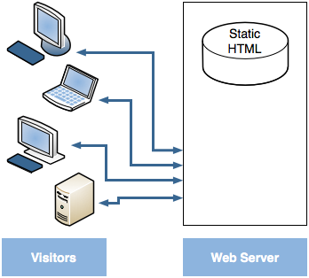
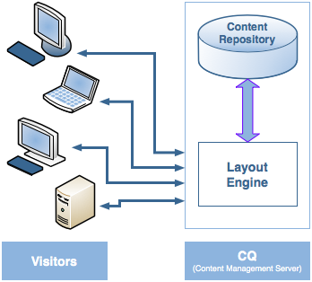
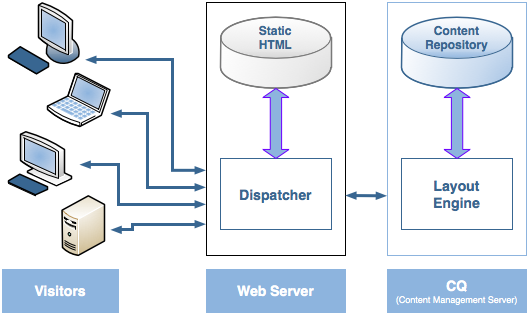
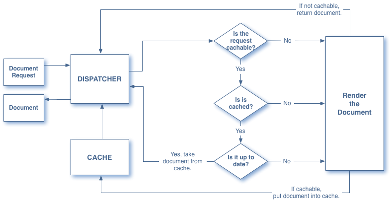

# Dispatcher Overview{#dispatcher-overview}

>[!NOTE]
>
>Dispatcher versions are independent of AEM. You may have been redirected to this page if you followed a link to the Dispatcher documentation that is embedded in the documentation for a previous version of AEM.

Dispatcher is Adobe Experience Manager's caching and/or load balancing tool. Using AEM's Dispatcher also helps to protect your AEM server from attack. Therefore, you can increase the security of your AEM instance by using the Dispatcher in conjunction with an enterprise-class web server.

The process for deploying a Dispatcher is independent of the web server and OS platform chosen:

1. Learn about Dispatcher (this page). Also, see [frequently asked questions about dispatcher](https://helpx.adobe.com/experience-manager/using/dispatcher-faq.html).
1. Install a [supported web server](https://helpx.adobe.com/experience-manager/6-3/sites/deploying/using/technical-requirements.html) according to the web server documentation.  

1. [Install the Dispatcher module](dispatcher-install.md) on your web server and configure the web server accordingly.
1. [Configure Dispatcher](dispatcher-configuration.md) (the dispatcher.any file).  

1. [Configure AEM](page-invalidate.md) so that content updates invalidate the cache.

>[!NOTE]
>
>To gain a better undestanding of how Dispatcher works with AEM see [Ask the AEM Community Experts for July 2017](http://bit.ly/ATACE0717).

Use the following information as required:

* [](http://helpx.adobe.com/cq/kb/index/dispatcher.html) [The Dispatcher Security Checklist](security-checklist.md)

* [The Dispatcher Knowledge Base](http://helpx.adobe.com/cq/kb/index/dispatcher.html)
* [Optimizing a Website for Cache Performance](optimizing-caching.md)
* [Using Dispatcher with Multiple Domains](dispatcher-domains.md)
* [Using SSL with Dispatcher](dispatcher-ssl.md)
* [Implementing Permission-Sensitive Caching](permissions-cache.md)
* [Troubleshooting Dispatcher Problems](dispatcher-troubleshooting.md)

>[!NOTE]
>
>**The most common use of Dispatcher** is to cache responses from an AEM **publish instance**, to increase the responsiveness and security of your externally facing published website. Most of the discussion focuses on this case.
>
>But, the Dispatcher can also be used to increase the responsiveness of your **author instance**, particularly if you have a large number users editing and updating your website. For details specific to this case see [Using a Dispatcher with an Author Server](#UsingaDispatcherwithanAuthorServer), below.

## Why use Dispatcher to implement Caching? {#why-use-dispatcher-to-implement-caching}

There are two basic approaches to web publishing:

* **Static Web Servers**: such as Apache or IIS, are very simple, but fast.
* **Content Management Servers**: which provide dynamic, real-time, intelligent content, but require much more computation time and other resources.

The Dispatcher helps realize an environment that is both fast and dynamic. It works as part of a static HTML server, such as Apache, with the aim of:

* storing (or "caching") as much of the site content as is possible, in the form of a static website
* accessing the layout engine as little as possible.

Which means that:

* **static content** is handled with exactly the same speed and ease as on a static web server;*additionally you can use the administration and security tools available for your static web server(s)*.

* **dynamic content** is generated as needed, without slowing the system down any more than absolutely necessary.

The Dispatcher contains mechanisms to generate, and update, static HTML based on the content of the dynamic site. You can specify in detail which documents are stored as static files and which are always generated dynamically.

This section illustrates the principles behind this.

### Static Web Server {#static-web-server}



A static web server, such as Apache or IIS, serves static HTML files to visitors of your website. Static pages are created once, so the same content will be delivered for each request.

This process is very simple, and thus extremely efficient. If a visitor requests a file (e.g. a HTML page), the file is usually taken directly from memory, at worst it is read from the local drive. Static web servers have been available for quite some time, so there is a wide range of tools for administration and security management, and they are very well integrated with network infrastructures.

### Content Management Servers {#content-management-servers}



If you use a Content Management Server, such as AEM, an advanced layout engine processes the request from a visitor. The engine reads content from a repository which, combined with styles, formats and access rights, transforms the content into a document that is tailored to the visitor's needs and rights.

This allows you to create richer, dynamic content, which increases the flexibility and functionality of your website. However, the layout engine requires more processing power than a static server, so this setup may be prone to slowdown if many visitors use the system.

## How Dispatcher performs Caching {#how-dispatcher-performs-caching}

 **The Cache Directory** For caching, the Dispatcher module uses the web server's ability to serve static content. The Dispatcher places the cached documents in the document root of the web server. 

>[!NOTE]
>
>When lacking the configuration for HTTP Header Caching, the Dispatcher stores only the HTML code of the page - it does not store the HTTP headers. This can be an issue if you use different encodings within your website, as these may get lost. To enable HTTP Header Caching, see [Configuring the Dispatcher Cache.](/using/dispatcher-configuration.html?cq_ck=1510236516566)

>[!NOTE]
>
>Locating the document root of your web server on network-attached storage (NAS) causes performance degradation. Also, when a document root that is located on NAS is shared between multiple web servers, intermittant locks can occur when replication actions are performed.

>[!NOTE]
>
>The Dispatcher stores the cached document in a structure equal to the requested URL. 
>
>There can be OS-level limitations for length of file name; i.e. if you have an URL with a lot of selectors.

### Methods for Caching

The Dispatcher has two primary methods for updating the cache content when changes are made to the website.

* **Content Updates** remove the pages that have changed, as well as files that are directly associated with them.
* **Auto-Invalidation** automatically invalidates those parts of the cache that may be out of date after an update. i.e. it effectively flags relevant pages as being out of date, without deleting anything.

### Content Updates

In a content update, one or more AEM documents change. AEM sends a syndication request to the Dispatcher, which updates the cache accordingly:

1. It deletes the modified file(s) from the cache.
1. It deletes all files that start with the same handle from the cache. For example, if the file /en/index.html is updated, all the files that start with /en/index. are deleted. This mechanism allows you to design cache-efficient sites, especially in regard to picture navigations.
1. It *touches* the so-called **statfile**; this updates the timestamp of the statfile to indicate the date of the last change.

The following points should be noted:

* Content Updates are typically used in conjunction with an authoring system which "knows" what must be replaced.
* Files that are affected by a content update are removed, but not replaced immediately. The next time such a file is requested, the Dispatcher fetches the new file from the AEM instance and places it in the cache, thereby overwriting the old content.
* Typically, automatically generated pictures that incorporate text from a page are stored in picture files starting with the same handle - thus ensuring that the association exists for deletion. For example, you may store the title text of the page mypage.html as the picture mypage.titlePicture.gif in the same folder. This way the picture is automatically deleted from the cache each time the page is updated, so you can be sure that the picture always reflects the current version of the page.
* You may have several statfiles, for example one per language folder. If a page is updated, AEM looks for the next parent folder containing a statfile, and *touches* that file.

### Auto-invalidation

Auto-invalidation automatically invalidates parts of the cache - without physically deleting any files. At every content update, the so-called statfile is touched, so its timestamp reflects the last content update.

The Dispatcher has a list of files that are subject to auto-invalidation. When a document from that list is requested, the Dispatcher compares the date of the cached document with the timestamp of the statfile:

* if the cached document is newer, the Dispatcher returns it.
* if it is older, the Dispatcher retrieves the current version from the AEM instance.

Again, certain points should be noted:

* Auto invalidation is typically used when the inter-relations are complex e.g. for HTML pages. These pages contain links and navigation entries, so they usually have to be updated after a content update. If you have automatically generated PDF or picture files, you may choose to auto-invalidate those too.
* Auto-invalidation does not involve any action by the dispatcher at update time, except for touching the statfile. However, touching the statfile automatically renders the cache content obsolete, without physically removing it from the cache.

## How Dispatcher returns Documents {#how-dispatcher-returns-documents}



### Determining whether a document is subject to caching

You can [define which documents the Dispatcher caches in the configuration file](dispatcher-configuration.md#main-pars_146_44_0010). The Dispatcher checks the request against the list of cacheable documents. If the document is not in this list, the Dispatcher requests the document from the AEM instance.

The Dispatcher *always* requests the document directly from the AEM instance in the following cases:

* If the request URI contains a question mark "?". This usually indicates a dynamic page, such as a search result, which does not need to be cached.
* The file extension is missing. The web server needs the extension to determine the document type (the MIME-type).
* The authentication header is set (this can be configured)

>[!NOTE]
>
>The GET or HEAD (for the HTTP header) methods are cacheable by the Dispatcher. For additional information on response header caching, see the [Caching HTTP Response Headers](dispatcher-configuration.md#CachingHTTPResponseHeaders) section.

### Determining if a document is cached

The Dispatcher stores the cached files on the web server as if they were part of a static website. If a user requests a cacheable document the Dispatcher checks whether that document exists in the web server's file system:

* if the document is cached, Dispatcher returns the file.
* if it is not cached, the Dispatcher requests the document from the AEM instance.

### Determining if a document is up-to-date

To find out if a document is up to date, the Dispatcher performs two steps:

1. It checks whether the document is subject to auto-invalidation. If not, the document is considered up-to-date.
1. If the document is configured for auto-invalidation, the Dispatcher checks whether it is older or newer than the last change available. If it is older, the Dispatcher requests the current version from the AEM instance and replaces the version in the cache.

>[!NOTE]
>
>Documents without **auto-invalidation** remain in the cache until they are physically deleted; e.g. by a content update on the web site.

## The Benefits of Load Balancing {#the-benefits-of-load-balancing}

Load Balancing is the practice of distributing the computational load of the website across several instances of AEM.


You gain:

* **increased processing power** 
  In practice this means that the Dispatcher shares document requests between several instances of AEM. Because each instance now has fewer documents to process, you have faster response times. The Dispatcher keeps internal statistics for each document category, so it can estimate the load and distribute the queries efficiently.

* **increased fail-safe coverage** 
  If the Dispatcher does not receive responses from an instance, it will automatically relay requests to one of the other instance(s). Thus, if an instance becomes unavailable, the only effect is a slowdown of the site, proportionate to the computational power lost. However, all services will continue.

* you can also manage different websites on the same static web server.

>[!NOTE]
>
>While load balancing spreads the load efficiently, caching helps to reduce the load. Therefore, try to optimize caching and reduce the overall load before you set up load balancing. Good caching may increase the load balancer's performance, or render load balancing unnecessary.

>[!CAUTION]
>
>While a single Dispatcher will usually be able to saturate the capacity of the available Publish instances, for some rare applications it can make sense to additionally balance the load between two Dispatcher instances. Configurations with multiple Dispatchers need to be considered carefully, since an additional Dispatcher will increase the load on the available Publish instances and can easily decrease performance in most applications.

## How the Dispatcher performs Load Balancing {#how-the-dispatcher-performs-load-balancing}

### Performance Statistics

The Dispatcher keeps internal statistics about how fast each instance of AEM processes documents. Based on this data, the Dispatcher estimates which instance will provide the quickest response time when answering a request, and so it reserves the necessary computation time on that instance.

Different types of requests may have differing average completion times, so the Dispatcher allows you to specify document categories. These are then considered when computing the time estimates. For example, you can make a distinction between HTML pages and images, as the typical response times may well differ.

If you use an elaborate search function, you may create a new category for search queries. This helps the Dispatcher send search queries to the instance that responds fastest. This prevents a slower instance from stalling when it receives several "expensive" search queries, while the others get the "cheaper" requests.

### Personalized content (Sticky Connections)

Sticky connections ensure that documents for one user are all composed on the same instance of AEM. This is important if you use personalized pages and session data. The data is stored on the instance, so subsequent requests from the same user must return to that instance or the data is lost.

Because sticky connections restrict the Dispatcher's ability to optimize the requests, you should use them only when needed. You can specify the folder that contains the "sticky" documents, thus ensuring all documents in that folder are composed on the same instance for each user.

>[!NOTE]
>
>For most pages that use sticky connections you have to switch off caching - otherwise the page looks the same to all users, regardless of the session content. 
>
>For a *few* applications, it can be possible to use both sticky connections and caching; for example, if you display a form that writes data to the session.

## Using Multiple Dispatchers {#using-multiple-dispatchers}

In complex setups, you may use multiple Dispatchers. For example, you may use:

* one Dispatcher to publish a website on the Intranet
* a second Dispatcher, under a different address and with different security settings, to publish the same content on the Internet.

In such a case, make sure that each request goes through only one Dispatcher. A Dispatcher does not handle requests that come from another Dispatcher. Therefore, make sure that both Dispatchers access the AEM website directly.

## Using Dispatcher with a CDN {#using-dispatcher-with-a-cdn}

A content delivery network (CDN), such as Akamai Edge Delivery or Amazon Cloud Front, deliver content from a location close to the end user. By that it

* speeds up response times for end users
* takes load off your servers

As an HTTP infrastructure component, a CDN works much like Dispatcher: when a CDN node receives a request, it serves the request from its cache if possible (the resource is available in the cache and is valid). Otherwise, it reaches out to the next closest server to retrieve the resource and cache it for further requests if appropriate.

The "next closest server" depends on your specific setup. For example, in an Akamai setup the request can take the following path:

* The Akamai Edge Node  
* The Akamai Midgres Layer
* Your firewall
* Your load balancer
* Dispatcher
* AEM

In most cases, Dispatcher is the next server that might serve the document from a cache and influence the response headers returned to the CDN server.

## Controlling a CDN cache {#controlling-a-cdn-cache}

There are a numer of ways to control for how long a CDN will cache a resource before it re-fetches is from Dispatcher.

1. Explicit configuration  
   Configure, how long particular resources are held in the CDN's cache, depending on mime type, extension, request type, etc.  

1. Expiration and cache-control headers  
   Most CDNs will honor `Expires:` and `Cache-Control:` HTTP Headers if sent by the upstream server. This can be achieved e.g. by using the [mod_expires](http://httpd.apache.org/docs/2.2/mod/mod_expires.html) Apache Module.

1. Manual invalidation  
   CDNs allow resources to be removed from the cache through web interfaces.
1. API based invalidation  
   Most CDNs also offer a REST and/or SOAP API that allows resources to be removed from the cache.

In a typical AEM setup, configuration by extension and/or path, which can be achieved through points 1 and 2 above, offers possibilities to set reasonable caching periods for often-used resources that do not change often, such as design images and client libraries. When new releases are deployed, typically a manual invalidation is required.

If this approach is used to cache managed content, it implies that content changes are only visible to end users once the configured caching period is expired and the document is fetched from Dispatcher again.

For finer-grained control, API based invalidation allows you to invalidate a CDN's cache as the Dispatcher cache is invalidated. Based on the CDNs API, you can implement your own [ContentBuilder](http://docs.adobe.com/docs/en/cq/current/javadoc/com/day/cq/replication/ContentBuilder.html) and [TransportHandler](http://docs.adobe.com/docs/en/cq/current/javadoc/com/day/cq/replication/TransportHandler.html) (if the API is not REST-based) and set up a Replication Agent that will use these to invalidate the CDN's cache.

>[!NOTE]
>
>See also [AEM (CQ) Dispatcher Security and CDN+Browser Caching](http://www.slideshare.net/andrewmkhoury/dispatcher-caching-aemgemspart2jan2015) and recorded presentation on [Dispatcher Caching](http://docs.adobe.com/content/ddc/en/gems/dispatcher-caching---new-features-and-optimizations.html).

## Using a Dispatcher with an Author Server {#using-a-dispatcher-with-an-author-server}

>[!CAUTION]
>
>if you are using [AEM with Touch UI](https://helpx.adobe.com/experience-manager/6-3/sites/developing/using/touch-ui-concepts.html) you should **not** cache author instance content. If caching was enabled for the author instance, you need to disable it and delete the contents of the cache directory. To disable caching, you should edit the `author_dispatcher.any` file and modify the `/rule` property of the `/cache` section as follows:

```
/rules
{
/0000
{ /type "deny" /glob "*"}
}
```

A Dispatcher can be used in front of an author instance to improve authoring performance. To configure an authoring Dispatcher, do the following:

1. Install a Dispatcher in a web server (this could be Apache or IIS web server, see [Installing Dispatcher](dispatcher-install.md)).
1. You may wish to test the newly installed Dispatcher against a working AEM publish instance, to ensure that a baseline correct install has been acheived.
1. Now make sure that the Dispatcher is able to connect via TCP/IP to your author instance.
1. Replace the Dispatcher's sample `dispatcher.any` file with the `author_dispatcher.any` file provided below.
1. Open the `author_dispatcher.any` in a text editor and make the following changes:

    1. Change the `/hostname` and `/port` of the `/renders` section to point to your author instance.
    1. Change the `/docroot` of the `/cache` section to point to a cache directory. In case you are using [AEM with Touch UI](https://helpx.adobe.com/experience-manager/6-3/sites/developing/using/touch-ui-concepts.html), see the warning above.
    1. Save the changes.

1. Delete all existing files in the `/cache` > `/docroot` directory which you configured above.
1. Restart the web server.

>[!NOTE]
>
>Please note that with the provided `author_dispatcher.any` configuration, when you install a CQ5 feature pack, hotfix, or application code package that affects any content under `/libs` or `/apps` then you must delete the cached files under those directories in your dispatcher cache to ensure that the next time they are requested the newly upgraded files are fetched, and not the old cached ones.

>[!CAUTION]
>
>If you have used the previously configured author dispatcher and enabled a *dispatcher flushing agent* then please do the following:

1. Delete or disable the **author dispatcher's** flushing agent on your AEM author instance.
1. Re-do the author dispatcher configuration by following the new instructions above.

<!--
[Author Dispatcher configuration file (Dispatcher 4.1.2 or later)](assets/author_dispatchernew.any)
-->
>[!NOTE]
>
>A related knowledge base article can be found here:  
>[How to configure the dispatcher in front of an authoring environment](http://helpx.adobe.com/cq/kb/HowToConfigureDispatcherForAuthoringEnvironment.html)

