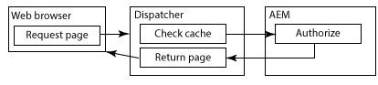
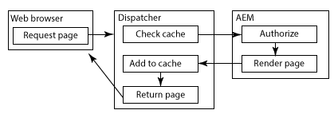
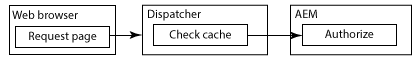

# Caching Secured Content{#caching-secured-content}

Permission-sensitive caching enables you to cache secured pages. Dispatcher checks users' access permissions for a page before delivering the cached page.

Dispatcher includes the AuthChecker module that implements permission-sensitive caching. When the module is activated, the render calls an AEM servlet to perform user authentication and authorization for the requested content. The servlet response determines whether the content is delivered to the web browser.

Because the methods of authentication and authorization are specific to the AEM deployment, you are required to create the servlet.

>[!NOTE]
>
>Use `deny` filters to enforce blanket security restrictions. Use permission-sensitive caching for pages that are configured to permit access to a subset of users or groups.

The following diagrams illustrate the order of events that occur when a web browser requests a page for which permission-sensitive caching is used.

#### Page is cached and user is authorized {#page-is-cached-and-user-is-authorized}



1. Dispatcher determines that the requested content is cached and valid.
1. Dispatcher sends a request message to the render. The HEAD section includes all of the header lines from the browser request.
1. The render calls the authorizer to perform the security check and responds to Dispatcher. The response message includes an HTTP status code of 200 to indicate that the user is authorized.
1. Dispatcher sends a response message to the browser that consists of the header lines from the render response and the cached content in the body.

#### Page is not cached and user is authorized {#page-is-not-cached-and-user-is-authorized}



1. Dispatcher determines that the content is not cached or requires updating.
1. Dispatcher forwards the original request to the render.
1. The render calls the authorizer servlet to perform a security check. When the user is authorized, the render includes the rendered page in the body of the response message.
1. Dispatcher forwards the response to the browser. Dispatcher adds the body of the render's response message to the cache.

#### User is not authorized {#user-is-not-authorized}



1. Dispatcher checks the cache.
1. Dispatcher sends a request message to the render that includes all header lines from the browser's request.
1. The render calls the authorizer servlet to perform a security check which fails, and the render forwards the original request to Dispatcher.

## Implementing permission-sensitive caching {#implementing-permission-sensitive-caching}

To implement permission-sensitive caching, perform the following tasks:

* Develop a servlet that performs authentication and authorization
* Configure the Dispatcher

>[!NOTE]
>
>Typically, secure resources are stored in a separate folder than unsecure files. For example, /content/secure/
>

#### Create the authorization servlet {#create-the-authorization-servlet}

Create and deploy a servlet that performs the authentication and authorization of the user who requests the web content. The servlet can use any authentication and authorization method, such as the AEM user account and repository ACLs, or an LDAP lookup service. You deploy the servlet to the AEM instance that Dispatcher uses as the render.

The servlet must be accessible to all users. Therefore, your servlet should extend the `org.apache.sling.api.servlets.SlingSafeMethodsServlet` class, which provides read-only access to the system.

The servlet recieves only HEAD requests from the render, so you only need to implement the `doHead` method.

The render includes the URI of the requested resource as a parameter of the HTTP request. For example, an authorization servlet is accessed via `/bin/permissioncheck`. To perform a security check on the /content/geometrixx-outdoors/en.html page, the render includes the following URL in the HTTP request:

`/bin/permissioncheck?uri=/content/geometrixx-outdoors/en.html`

The servlet response message must contain the following HTTP status codes:

* 200: Authentication and authorization passed.

The following example servlet obtains the URL of the requested resource from the HTTP request. The code uses the Felix SCR `Property` annotation to set the value of the `sling.servlet.paths` property to /bin/permissioncheck. In the `doHead` method, the servlet obtains the session object and uses the `checkPermission` method to determine the appropriate response code.

>[!NOTE]
>
>The value of the sling.servlet.paths property must be enabled in the Sling Servlet Resolver (org.apache.sling.servlets.resolver.SlingServletResolver) service.

#### Example servlet {#example-servlet}

```java
package com.adobe.example;

import org.apache.felix.scr.annotations.Component;
import org.apache.felix.scr.annotations.Service;
import org.apache.felix.scr.annotations.Property;

import org.apache.sling.api.SlingHttpServletRequest;
import org.apache.sling.api.SlingHttpServletResponse;
import org.apache.sling.api.servlets.SlingSafeMethodsServlet;

import org.slf4j.Logger;
import org.slf4j.LoggerFactory;

import javax.jcr.Session;

@Component(metatype=false)
@Service
public class AuthcheckerServlet extends SlingSafeMethodsServlet {
 
    @Property(value="/bin/permissioncheck")
    static final String SERVLET_PATH="sling.servlet.paths";
    
    private Logger logger = LoggerFactory.getLogger(this.getClass());
    
    public void doHead(SlingHttpServletRequest request, SlingHttpServletResponse response) {
     try{ 
      //retrieve the requested URL
      String uri = request.getParameter("uri");
      //obtain the session from the request
      Session session = request.getResourceResolver().adaptTo(javax.jcr.Session.class);     
      //perform the permissions check
      try {
       session.checkPermission(uri, Session.ACTION_READ);
       logger.info("authchecker says OK");
       response.setStatus(SlingHttpServletResponse.SC_OK);
      } catch(Exception e) {
       logger.info("authchecker says READ access DENIED!");
       response.setStatus(SlingHttpServletResponse.SC_FORBIDDEN);
      }
     }catch(Exception e){
      logger.error("authchecker servlet exception: " + e.getMessage());
     }
    }
}
```

#### Configure Dispatcher for permission-sensitive caching {#configure-dispatcher-for-permission-sensitive-caching}

The auth_checker section of the dispatcher.any file controls the behavior of permission-sensitive caching. The auth_checker section includes the following subsections:

* `url`: The value of the `sling.servlet.paths` property of the servlet that performs the security check.

* `filter`: Filters that specify the folders to which permission-sensitive caching is applied. Typically, a `deny` filter is applied to all folders, and `allow` filters are applied to secured folders. 

* `headers`: Specifies the HTTP headers that the authorization servlet includes in the response.

When Dispatcher starts, the Dispatcher log file includes the following debug-level message:

`AuthChecker: initialized with URL '*configured_url*'.`

The following example auth_checker section configures Dispatcher to use the servlet of the prevoius topic. The filter section causes permission checks to be performed only on secure HTML resources.

#### Example configuration {#example-configuration}

```xml
/auth_checker
  {
  # request is sent to this URL with '?uri=<page>' appended
  /url "/bin/permissioncheck"
      
  # only the requested pages matching the filter section below are checked,
  # all other pages get delivered unchecked
  /filter
    {
    /0000
      {
      /glob "*"
      /type "deny"
      }
    /0001
      {
      /glob "/content/secure/*.html"
      /type "allow"
      }
    }
  # any header line returned from the auth_checker's HEAD request matching
  # the section below will be returned as well
  /headers
    {
    /0000
      {
      /glob "*"
      /type "deny"
      }
    /0001
      {
      /glob "Set-Cookie:*"
      /type "allow"
      }
    }
  }
```

